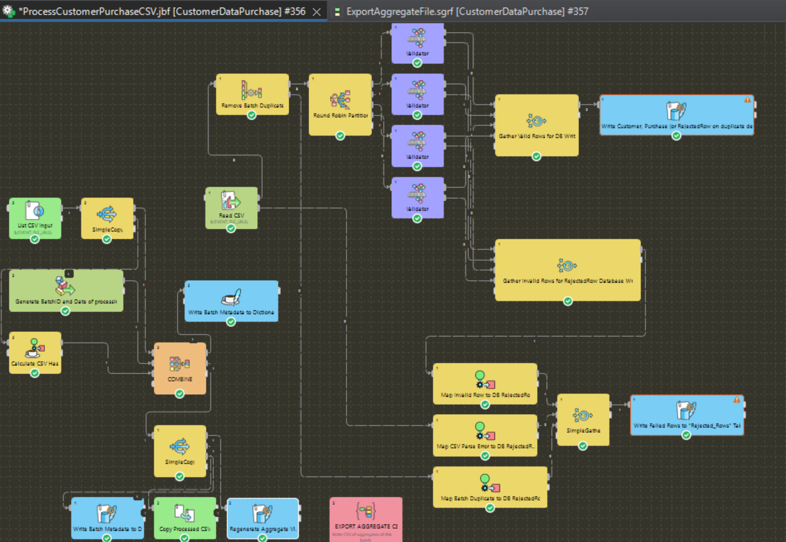
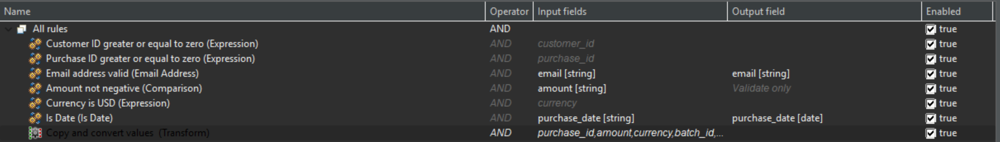
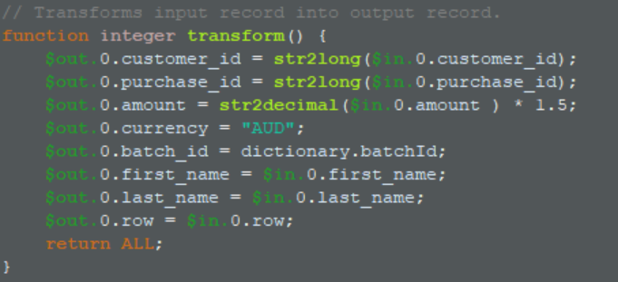
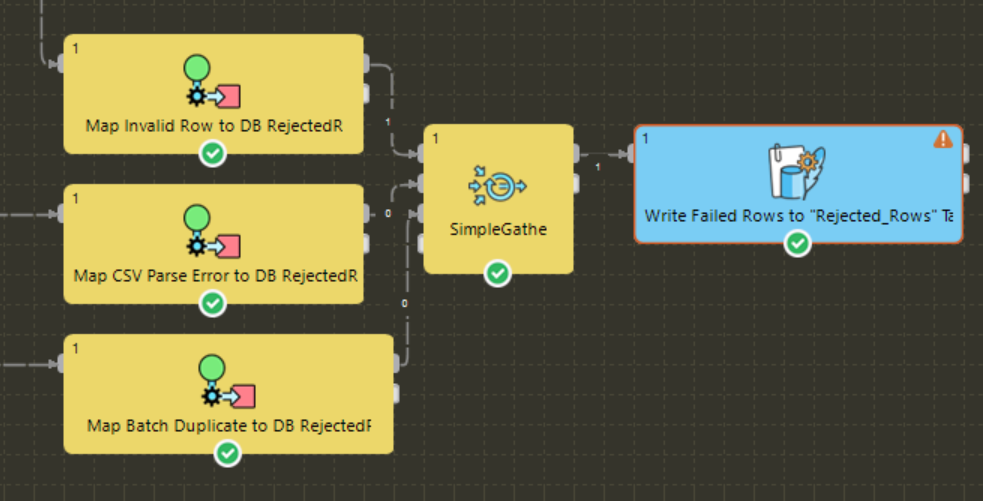
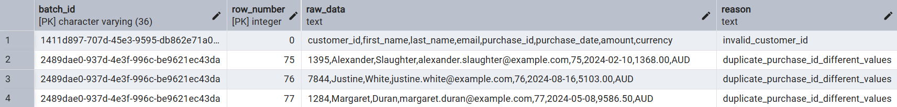
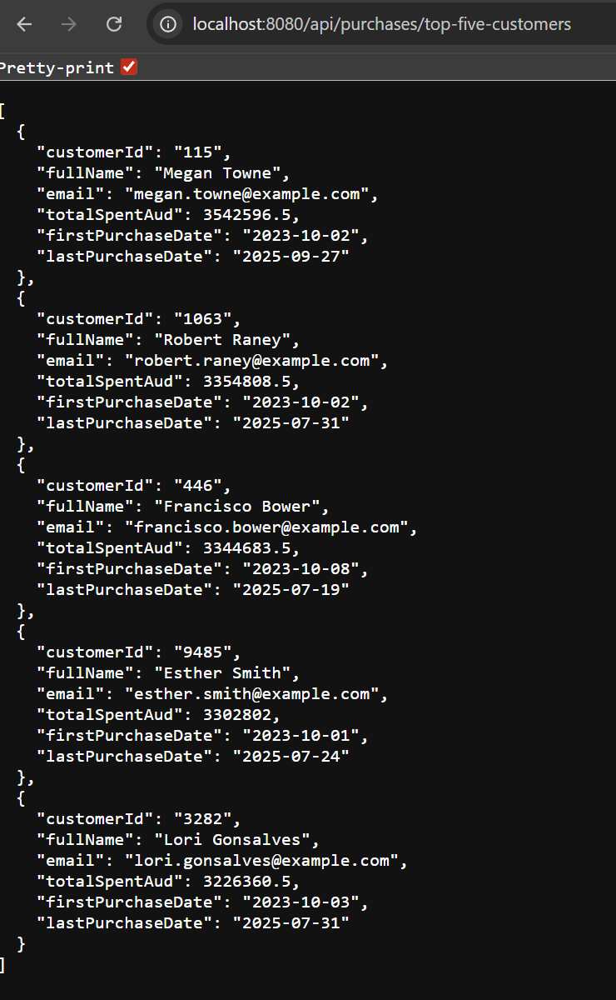
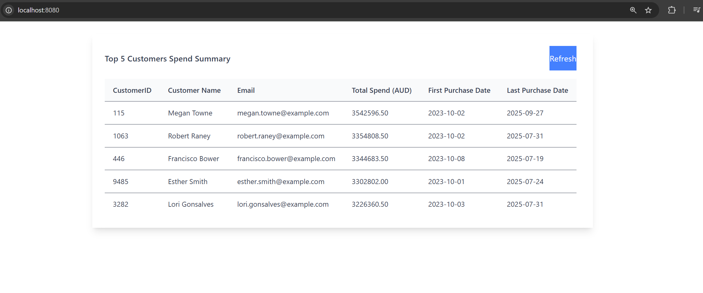

# Customer Purchase Data ETL (Senior Full Stack - ETL Developer Technical Test)

## Requirements

1. CSV is imported of format 'customer_id,first_name,last_name,email,purchase_id,purchase_date,amount,currency'
2. Validate that CSV is of valid format
3. Transform USD to AUD (1 USD = 1.5 AUD)
4. Export with format 'customer_id,full_name,email,total_spent_aud,first_purchase_date,last_purchase_date'
5. Load into DB
6. Write a SQL query to return the top 5 customers by total_spent_aud
7. Demonstrate RDBMS performance tuning with indexes and partitions
8. Use CloverDX
9. Move files to locations after processing

## Assumptions
1. USD is the only valid currency, anything else is invalid
2. There are no security considerations for this system
3. customer_id and purchase_id must be positive integers
4. date is only of format 'yyyy-MM-dd'
5. email must be valid
6. amount must be non-negative number (decimals allowed)
7. no strict performance requirements provided for ETL pipeline (it runs once daily)
8. import CSV is expected to have headers

## Challenges that caused changes
- I attempted to use Minio as a mock for S3, unfortunately I could not get CloverDX talking to it as it's S3 client appears to only work with actual S3. I attempted to setup Azure as a mock for Azure Blob Storage also and had similar problems. I gave up on using these and I did not want to use the actual services for simplicity and cost. I mapped a file directory into CloverDX that is used instead of a cloud file service.

- Issues were had with processing LF ended CSVs in CloverDX. As such, the ETL pipeline only handles CR LF ended CSVS.

## What I could continue working on
- More developed UI (material-tailwind components aren't working properly atm and data could be more presentable)
- Batch viewer in UI
- Currency conversion data source
- Performance optimisation (parallel reader for example)
- Look into worker nodes and productionising this setup
- Fix the issues I had with S3/Azure-Blob-Storage and LF ended CSVs
- Testing scripts

## Design

An ETL pipeline will be created using CloverDX. As this is a prototype, docker-compose will be used to deploy CloverDX via its server image. A Spring Boot RESTful service will be written to present the "top 5" as required. A simple React app will be written to display the "top 5" in a table.

### Components
- CloverDX Server in Docker
  - `./etl/sandboxes/CustomerDataPurchaseSandbox/` for sandbox with job and graph used.
  - `./etl/clover-server-config.xml` for setting up the event listener
  - `./etl/license` for a valid CloverDX license
- Spring Boot RESTful Server
  - `./presentation/purchase-data-rest/`
- React SPA 
  - `./presentation/web-client/`
- Postgres for Cloverdx
- Postgres for data warehouse
- NGINX reverse proxy

The above components are deployable with docker-compose
```bash
docker-compose up
```

After the compose is up
[cloverDX](http://localhost:8080/clover)
[customer purchase rest](http://localhost:8080/api/purchases/top-five-customers)
[web client](http://ocalhost:8080)

To start processing a CSV file drag it into the `./etl/files/raw` folder (ensure it is CRLF ended as mentioned above). The file must end in `.csv`. The pipeline run can be seen in the cloverDX server dashboard. After the data is ETL'ed, `./etl/files/processed/${UUID}.csv` will contain a clone of the raw input csv and `./etl/files/aggregate/${UUID}.csv` will contain the aggregated CSV.


A python script was written to generate CSVs.
```bash
pip3 install -r requirements.txt

python3 generate-random-csv.py

```

The UI will present the 'top 5' customers across all aggregate when loaded.


### Schemas

These are also inside the [spring flyway migration folder](presentation/purchase-data-rest/src/main/resources/db/migration).
```sql
CREATE TABLE customers (
  customer_id BIGINT PRIMARY KEY,
  first_name TEXT,
  last_name TEXT,
  email TEXT
);

CREATE INDEX idx_customers_email ON customers(email);

---

CREATE TABLE import_batches (
  batch_id VARCHAR(36) PRIMARY KEY,
  file_name TEXT,
  file_hash VARCHAR(64) NOT NULL UNIQUE,
  file_location TEXT,
  processed_at TIMESTAMP DEFAULT NOW()
);

---

CREATE TABLE purchases (
  purchase_id BIGINT NOT NULL PRIMARY KEY,
  customer_id BIGINT NOT NULL,
  purchase_date DATE NOT NULL,
  amount_aud DECIMAL(18,2) NOT NULL CHECK (amount_aud >= 0),
  import_batch_id VARCHAR(36) NOT NULL,
  CONSTRAINT fk_customer FOREIGN KEY (customer_id) REFERENCES customers(customer_id),
  CONSTRAINT fk_import_batch FOREIGN KEY (import_batch_id) REFERENCES import_batches(batch_id) ON DELETE CASCADE
);

CREATE INDEX idx_purchases_customer ON purchases(customer_id);
CREATE INDEX idx_purchases_batch ON purchases(import_batch_id);
CREATE INDEX IF NOT EXISTS brin_purchases_date ON purchases USING BRIN (purchase_date) WITH (pages_per_range = 128);
---

CREATE TABLE rejected_rows (
  batch_id VARCHAR(36) NOT NULL,
  row_number INT,
  raw_data TEXT,
  reason TEXT,
  PRIMARY KEY (batch_id, row_number),
  CONSTRAINT fk_rejected_batch FOREIGN KEY (batch_id) REFERENCES import_batches(batch_id) ON DELETE CASCADE
);

---

CREATE MATERIALIZED VIEW customer_spend_summary AS
SELECT
  c.customer_id,
  c.first_name || ' ' || c.last_name AS full_name,
  c.email,
  SUM(p.amount_aud) AS total_spent_aud,
  MIN(p.purchase_date) AS first_purchase_date,
  MAX(p.purchase_date) AS last_purchase_date
FROM customers c
JOIN purchases p USING (customer_id)
GROUP BY c.customer_id, c.first_name, c.last_name, c.email;

CREATE UNIQUE INDEX mv_customer_spend_pk ON customer_spend_summary (customer_id);
CREATE INDEX idx_total_spent_aud ON customer_spend_summary (total_spent_aud DESC);
```

Instead of storing data in the given output form, it is instead stored in a normalised form with information about the csv or "batch" stored, customer information stored, and purchase information stored. To fulfill the required output form, a materialised view is used - this allows the desired output to be provided while keeping normalised data in the DB that can be used in more versatile ways in the future.

Indexes were created on key fields of information that are being used frequently in the current design. A block range index is also provided for purchase_date in purchases to help date range queries.

No partitioning was performed as suggested. The top 5 query would not get significant performance gains over the materialised view with partitioning. Partitioning would be valuable across dates or customers if querying on that was needed. 

### CloverDX (ETL)




#### Ingestion
Trigger: CloverDX Server File Event Listener watching /data/raw for any csv file that lands.

1. Event listener triggers ProcessCustomerPurchaseCSV jobflow
2. A UUID to represent the csv being processed is generated
3. The date of the event starting is recorded
4. A hash of the file, UUID, date and output location are written to the import_batch table.
5. The csv is read and processed with validation, USD to AUD transformation, and DB loading and outputted to the desired aggregate format in a csv.

#### Validation and Transformation

Rows are checked for duplicate purchase_ids and if found, the first one continues to be processed while the following are rejected. 

A "partitioner" with a round-robin algorithm distributes rows to 4 validators that also perform transformations. 4 validators were used as this was found to be a bottleneck in development.

The stated requirements and assumptions above are validated against the data, and the USD to AUD conversion is performed.

1. High Level Validation

")

2. Validation Rules



3. USD Transformation inside Validator



#### Invalid-Data/Error Handling and Warehouse Loading

Invalid data caught inside CloverDX is written to the DB.

1. Invalid data mappers and DB Writer



2. Invalid rows written with an error code



When loading "purchases" into the DB, duplicate detection occurs and duplicate records are written to the "rejected_row" table.

```sql
-- create purchases, save duplicate purchase IDs to rejected row table
INSERT INTO public.purchases (purchase_id, customer_id, purchase_date, amount_aud, import_batch_id)
VALUES ($purchase_id, $customer_id, $purchase_date, $amount, $batch_id)
ON CONFLICT (purchase_id) DO NOTHING;

-- insert dupes into error table (clover validation is preventing me from using a CTE unfortunately)
INSERT INTO public.rejected_rows (batch_id, "row_number", raw_data, reason)
SELECT
  $batch_id AS batch_id,
  $row AS row_number,
  (
    CAST($customer_id AS bigint)::text || ',' ||
    COALESCE($first_name, '')          || ',' ||
    COALESCE($last_name,  '')          || ',' ||
    COALESCE($email,      '')          || ',' ||
    CAST($purchase_id AS bigint)::text || ',' ||
    TO_CHAR(CAST($purchase_date AS date), 'YYYY-MM-DD') || ',' ||
    (CAST($amount AS numeric))::text    || ',' ||
    COALESCE($currency, '')
  ) AS raw_data,
  CASE
    WHEN (p.customer_id, p.purchase_date, p.amount_aud)
         IS DISTINCT FROM ($customer_id, $purchase_date, $amount)
      THEN 'duplicate_purchase_id_different_values'
    ELSE 'duplicate_purchase_id_same_values'
  END AS reason
FROM public.purchases p
WHERE p.purchase_id = $purchase_id 
AND NOT EXISTS (
	SELECT 1
	FROM public.purchases px
	WHERE px.purchase_id = $purchase_id
    AND px.import_batch_id = $batch_id
);
```

If a customer_id is found in the 'customer' table, an upsert is performed on the first name, last name and email. This is done as no requirement was given here, and data normalisation was desired. 

```sql
-- create customers
INSERT INTO public.customers AS c (customer_id, first_name, last_name, email)
VALUES ($customer_id, $first_name, $last_name, $email)
ON CONFLICT (customer_id)
DO UPDATE
SET first_name = EXCLUDED.first_name,
    last_name  = EXCLUDED.last_name,
    email      = EXCLUDED.email;
```

#### Post DB Load actions
The materialised view of customer purchases is regenerated after the DB load occurs. 

The initiating CSV is copied to an output location, and an aggregate file of the batch is written to the aggregate folder.

The view is regenerated as such.
```sql
REFRESH MATERIALIZED VIEW CONCURRENTLY customer_spend_summary;
```

The batch aggregate is read from the DB with the below query and written to a csv.
```sql
SELECT
  $customer_id:=c.customer_id                                  AS customer_id,
  $full_name:=(c.first_name || ' ' || c.last_name)             AS full_name,
  $email:=c.email                                              AS email,
  $total_spent_aud:=SUM(p.amount_aud)                          AS total_spent_aud,
  $first_purchase_date:=MIN(p.purchase_date)                   AS first_purchase_date,
  $last_purchase_date:=MAX(p.purchase_date)                    AS last_purchase_date
FROM customers c
JOIN purchases p USING (customer_id)
WHERE p.import_batch_id = ${BATCH_ID}
GROUP BY c.customer_id, c.first_name, c.last_name, c.email;
```

### Post-ETL Presentation
#### Spring Boot RESTful API


#### React Client



